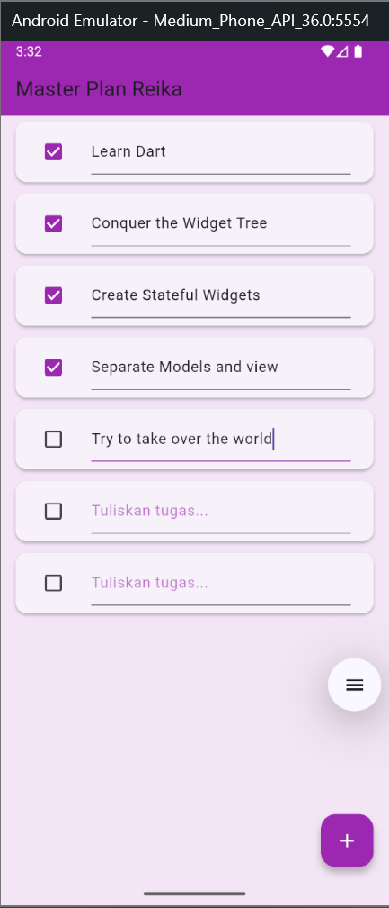
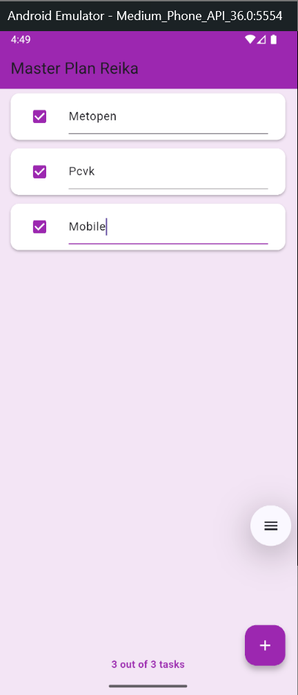
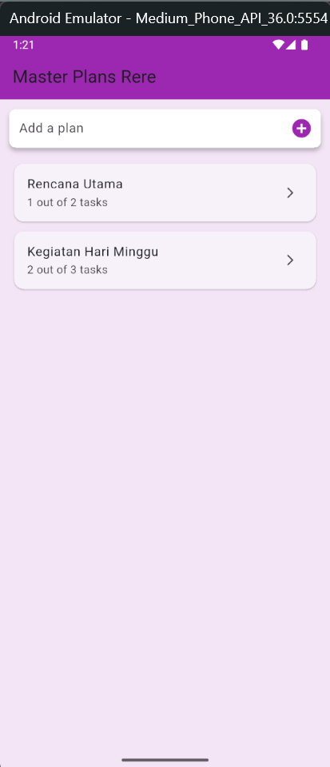
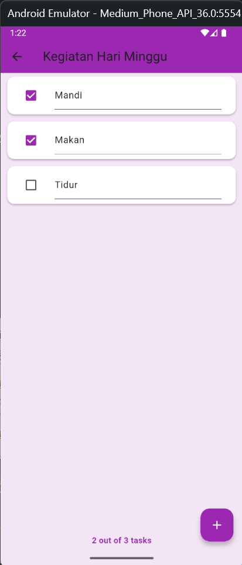
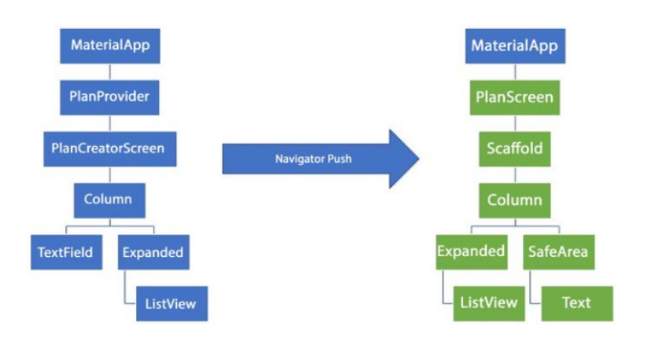

# Dasar State Management

## Praktikum 1: Dasar State dengan Model-View
Pada praktikum 1 ini bertujuan untuk membuat aplikasi sederhana bernama Master Plan menggunakan Flutter, di mana pengguna dapat menambahkan, mengedit, dan menandai tugas yang sudah selesai. Praktikum ini melatih pemahaman tentang penggunaan StatefulWidget, pengelolaan state dengan setState(), serta penerapan model data untuk menyimpan daftar tugas agar tampilan aplikasi dapat berubah secara dinamis sesuai interaksi pengguna.

## Tugas Praktikum 1: Dasar State dengan Model-View

2. Jelaskan maksud dari langkah 4 pada praktikum tersebut! Mengapa dilakukan demikian?
- Langkah 4 bertujuan untuk membuat class model data seperti Task dan Plan agar aplikasi memiliki struktur penyimpanan data yang rapi. Dengan memisahkan logika data dari tampilan, aplikasi menjadi lebih mudah dikembangkan dan dikelola. Hal ini dilakukan agar setiap tugas dan rencana dapat direpresentasikan sebagai objek yang bisa digunakan kembali di berbagai bagian aplikasi.

3. Mengapa perlu variabel plan di langkah 6 pada praktikum tersebut? Mengapa dibuat konstanta ?
- Variabel plan digunakan untuk menyimpan data utama aplikasi, yaitu daftar rencana dan tugas-tugas di dalamnya. Variabel ini penting agar setiap perubahan seperti menambah, mengedit, atau mencentang tugas bisa diperbarui di tampilan. Awalnya dibuat sebagai konstanta (const) agar data memiliki nilai awal yang tetap, namun kemudian diubah menjadi variabel biasa agar bisa dimodifikasi sesuai interaksi pengguna.

4. Lakukan capture hasil dari Langkah 9 berupa GIF, kemudian jelaskan apa yang telah Anda buat!

- Pada langkah 9, dibuat tampilan setiap item tugas (task) menggunakan widget ListTile yang berisi Checkbox dan TextFormField. Checkbox berfungsi untuk menandai apakah tugas sudah selesai, sedangkan TextFormField digunakan untuk menulis atau mengedit deskripsi tugas. Hasilnya, aplikasi menampilkan daftar tugas yang bisa diubah secara interaktif oleh pengguna.

5. Apa kegunaan method pada Langkah 11 dan 13 dalam lifecyle state ?
- Method pada langkah 11 dan 13 adalah initState() dan dispose().
- initState() digunakan untuk inisialisasi awal, seperti membuat ScrollController sebelum tampilan muncul.
- Sedangkan dispose() digunakan untuk membersihkan resource (misalnya menutup controller) saat widget dihapus dari layar, agar tidak terjadi kebocoran memori.

## Praktikum 2: Mengelola Data Layer dengan InheritedWidget dan InheritedNotifier

Pada praktikum 2 ini, aplikasi “Master Plan” masih menampilkan fungsi yang sama seperti praktikum 1, pengguna dapat menambah, mengedit, dan menandai tugas yang sudah selesai. Namun perbedaan utama terletak pada cara data dikelola.
Kalau di praktikum 1, data (Plan dan Task) hanya disimpan langsung di StatefulWidget.
Sedangkan di praktikum 2, data disimpan menggunakan InheritedNotifier (melalui PlanProvider), sehingga data bisa dibagikan ke seluruh widget tree dengan lebih efisien tanpa perlu terus menerus mengoper variabel secara manual. Jadi meskipun hasil tampilan dan fungsi terlihat sama, struktur kodenya lebih rapi, efisien, dan scalable.

## Tugas Praktikum 2: InheritedWidget

2. Jelaskan mana yang dimaksud InheritedWidget pada langkah 1 tersebut! Mengapa yang digunakan InheritedNotifier?
- InheritedWidget adalah widget khusus di Flutter yang berfungsi membagikan data ke widget lain yang ada di bawahnya dalam tree tanpa harus mengoper data lewat konstruktor. Dalam praktikum ini, digunakan InheritedNotifier karena selain membagikan data (Plan), kita juga ingin mendengarkan perubahan nilai (notifikasi) secara otomatis setiap kali data berubah.
- Jadi, PlanProvider dibuat sebagai kelas turunan InheritedNotifier<ValueNotifier<Plan>> agar UI bisa langsung ter-update otomatis setiap kali data Plan berubah.

3. Jelaskan maksud dari method di langkah 3 pada praktikum tersebut! Mengapa dilakukan demikian?
- Methodnya yaitu method of(BuildContext context) di dalam PlanProvider. Fungsi method ini adalah untuk mengambil (mengakses) notifier atau data Plan dari widget PlanProvider yang ada di atasnya di widget tree. Dengan cara ini, kita bisa mendapatkan data Plan di mana pun di dalam tree tanpa harus terus mengirimnya lewat parameter konstruktor. Ini dilakukan supaya kode lebih bersih dan efisien, terutama ketika aplikasi makin besar.

4. Lakukan capture hasil dari Langkah 9 berupa GIF, kemudian jelaskan apa yang telah Anda buat!
- 
- Berfungsi untuk menambah daftar tugas, mengedit teks, dan menandai tugas yang sudah selesai (checkbox). Setiap kali pengguna menambah atau menandai tugas, pesan di bagian bawah otomatis berubah (misalnya: “2 out of 3 tasks”) sesuai jumlah tugas yang selesai. Hal ini bisa terjadi karena ValueNotifier di dalam InheritedNotifier (PlanProvider) memberitahu UI untuk memperbarui tampilannya setiap kali data berubah.

## Praktikum 3: Membuat State di Multiple Screens

Hasil Praktikum 3

## Tugas Praktikum 3: State di Multiple Screens
2. Berdasarkan Praktikum 3 yang telah Anda lakukan, jelaskan maksud dari gambar diagram berikut ini!

- Diagram pada gambar diatas menggambarkan alur navigasi dan struktur hierarki widget pada aplikasi yang dibuat dalam Praktikum 3. Pada bagian kiri terlihat bahwa aplikasi dimulai dari `MaterialApp`, kemudian data plan dikelola melalui `PlanProvider`, dan selanjutnya ditampilkan pada `PlanCreatorScreen`. Pada halaman ini terdapat struktur layout berupa `Column` yang berisi `TextField` untuk memasukkan deskripsi task dan `Expanded` yang memuat `ListView` sebagai daftar task yang telah ditambahkan. Setelah plan selesai dibuat, aplikasi berpindah ke halaman berikutnya menggunakan navigasi `Navigator.push()`. Bagian kanan diagram menunjukkan halaman tujuan, yaitu `PlanScreen`, yang berada di dalam `MaterialApp`. Halaman ini menggunakan `Scaffold` sebagai struktur utama, kemudian menampilkan konten berupa `Column` dengan `Expanded` yang menampung `ListView` untuk menampilkan daftar task, serta `SafeArea` yang digunakan untuk menampilkan informasi status atau ringkasan task dalam bentuk `Text`. Dengan demikian, diagram ini menjelaskan bahwa Praktikum 3 mengimplementasikan dua halaman terpisah: satu untuk pembuatan plan dan task, dan satu untuk menampilkan hasilnya, sekaligus memperlihatkan bagaimana data tetap dipertahankan melalui `PlanProvider` selama proses navigasi berlangsung.

3. Lakukan capture hasil dari Langkah 14 berupa GIF, kemudian jelaskan apa yang telah Anda buat!

- GIF yang ditampilkan merupakan dokumentasi visual dari hasil implementasi Praktikum 3, khususnya fitur untuk membuat dan mengelola daftar rencana beserta tugas-tugasnya. GIF tersebut memperlihatkan seluruh alur penggunaan aplikasi, mulai dari pembuatan plan baru hingga penandaan tugas sebagai selesai.

Dalam GIF, pengguna dapat terlihat melakukan langkah-langkah berikut:

1. Menambahkan Plan baru
- Pengguna mengetik nama plan pada text field dan menekan Enter untuk menyimpannya.
- Plan baru otomatis muncul dalam daftar master plan.

2. Masuk ke halaman detail Plan
- Dengan melakukan tap pada salah satu plan, aplikasi berpindah ke PlanScreen melalui Navigator.push.

3. Menambahkan Task
- Pada halaman detail, pengguna dapat menekan tombol FloatingActionButton (+) untuk menambahkan task baru ke dalam plan.

4. Menandai Task sebagai selesai
- Pengguna dapat mencentang task untuk menandainya sebagai complete.
- Status completeness berubah secara real-time menggunakan ValueNotifier.

GIF ini menunjukkan bahwa fitur-fitur utama terkait state management dan navigasi antar screen telah berfungsi sesuai tujuan. Seluruh perubahan state dilakukan menggunakan InheritedNotifier dan ValueNotifier, tanpa library state management eksternal. Dengan demikian, GIF ini menjadi bukti bahwa aplikasi berhasil mengimplementasikan konsep “Lift State Up” serta pengelolaan state lintas screen.