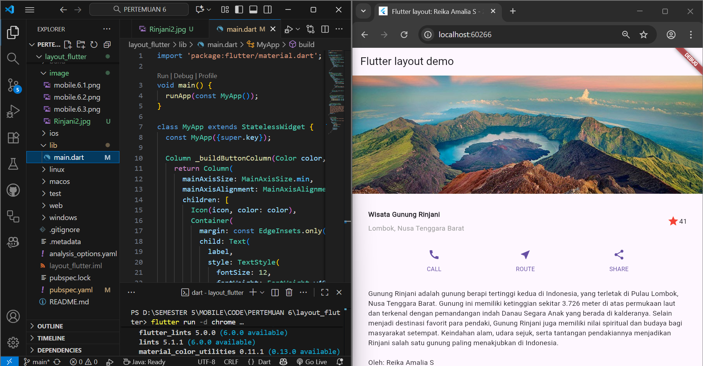
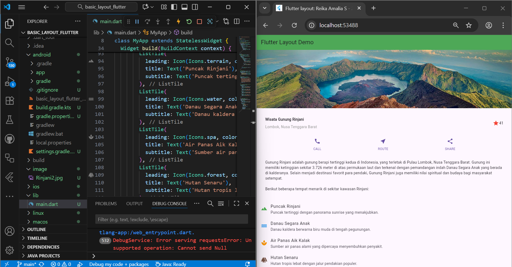

# layout_flutter

A new Flutter project.

## Praktikum 1
### Membangun Layout di Flutter

## Praktikum 2
### Implementasi button row

## Praktikum 3
### Implementasi text section

## Praktikum 4
### Implementasi image section

### Tugas Praktikum 1
1. Selesaikan Praktikum 1 sampai 4, lalu dokumentasikan dan push ke repository Anda berupa screenshot setiap hasil pekerjaan beserta penjelasannya di file README.md!
2. Silakan implementasikan di project baru "basic_layout_flutter" dengan mengakses sumber ini: https://docs.flutter.dev/codelabs/layout-basics
3. Kumpulkan link commit repository GitHub Anda kepada dosen yang telah disepakati!

## Praktikum 5
### Membangun Navigasi di Flutter

## Getting Started

This project is a starting point for a Flutter application.

A few resources to get you started if this is your first Flutter project:

- [Lab: Write your first Flutter app](https://docs.flutter.dev/get-started/codelab)
- [Cookbook: Useful Flutter samples](https://docs.flutter.dev/cookbook)

For help getting started with Flutter development, view the
[online documentation](https://docs.flutter.dev/), which offers tutorials,
samples, guidance on mobile development, and a full API reference.
