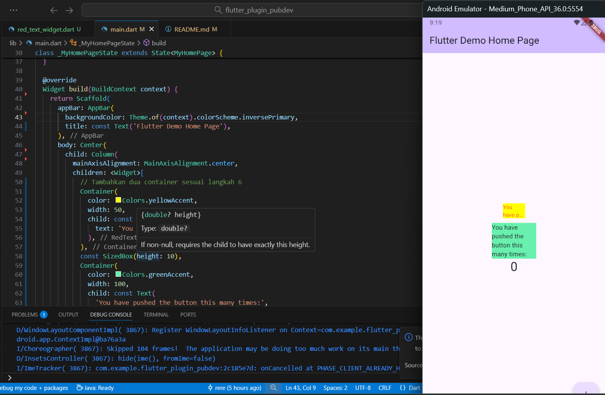

# flutter_plugin_pubdev

## Praktikum 1
### Praktikum Menerapkan Plugin di Project Flutter

### Langkah 4: Tambah Widget AutoSizeText
Setelah Anda menambahkan kode pada langkah 4, Anda akan mendapatkan info error. Mengapa demikian? Jelaskan dalam laporan praktikum Anda!
- Setelah menambahkan kode AutoSizeText, muncul error “The method 'AutoSizeText' isn't defined for the type 'RedTextWidget'” dan “Undefined name 'text'”.

Hal ini terjadi karena:
1. File red_text_widget.dart belum mengimpor paket auto_size_text sehingga Flutter tidak mengenali kelas AutoSizeText.
2. Variabel text belum didefinisikan di dalam widget RedTextWidget.

## Tugas Praktikum

2. Jelaskan maksud dari langkah 2 pada praktikum tersebut!
- Langkah 2 yaitu menambahkan plugin auto_size_text menggunakan perintah flutter pub add auto_size_text.
Tujuannya supaya project Flutter bisa memakai fitur tambahan dari plugin tersebut. Plugin ini berfungsi untuk membuat ukuran teks bisa menyesuaikan secara otomatis terhadap lebar atau tinggi ruang yang tersedia, jadi teks tidak terlalu panjang atau keluar dari batas tampilan.

3. Jelaskan maksud dari langkah 5 pada praktikum tersebut!
- Langkah 5 adalah menambahkan variabel text dan parameter di dalam constructor pada file red_text_widget.dart.
Tujuannya agar widget RedTextWidget bisa menerima teks dari luar ketika dipanggil di file lain (seperti main.dart).
Jadi jika ingin  menampilkan teks yang berbeda-beda, kita cukup mengganti nilai dari parameter text saat membuat widget. Dengan cara ini, widget akan fleksibel dan bisa dipakai berulang kali tanpa harus menulis ulang kode di dalamnya. Jika variabel text ini tidak dibuat, Flutter tidak akan tahu teks apa yang mau ditampilkan, makanya sebelumnya muncul error “Undefined name 'text'”.

4. Pada langkah 6 terdapat dua widget yang ditambahkan, jelaskan fungsi dan perbedaannya!
- Pada langkah 6, ada dua widget yang ditambahkan ke dalam children: yaitu RedTextWidget dan Text.
Keduanya sama-sama digunakan untuk menampilkan teks, tapi punya fungsi dan perilaku yang berbeda.
RedTextWidget adalah widget buatan sendiri yang di dalamnya menggunakan plugin auto_size_text. Karena itu, teks yang tampil bisa otomatis menyesuaikan ukuran hurufnya agar tetap muat dalam container.
Sementara widget Text adalah widget bawaan Flutter yang menampilkan teks dengan ukuran tetap, tidak bisa menyesuaikan secara otomatis. Jadi, kalau ruangnya sempit, teks bisa saja terpotong atau keluar dari batas container.
Intinya, RedTextWidget menunjukkan kelebihan plugin auto_size_text, sedangkan Text dipakai sebagai pembanding agar bisa melihat perbedaannya secara langsung.

5. Jelaskan maksud dari tiap parameter yang ada di dalam plugin auto_size_text berdasarkan tautan pada dokumentasi ini!
- Plugin auto_size_text memiliki beberapa parameter penting yang digunakan di praktikum, yaitu text, style, maxLines, dan overflow.
Parameter text berisi teks yang ingin ditampilkan di layar.
Parameter style digunakan untuk mengatur tampilan teks seperti warna, ukuran font, dan gaya hurufnya.
Parameter maxLines menentukan berapa baris maksimal teks yang boleh ditampilkan, jika teksnya lebih panjang dari jumlah baris yang diizinkan, sisanya tidak akan ditampilkan.
Lalu untuk bagian yang tidak ditampilkan itu diatur oleh parameter overflow, dan di sini nilainya TextOverflow.ellipsis, artinya teks yang kelebihan akan diganti dengan tanda titik tiga (...).
Secara keseluruhan, parameter-parameter ini membuat teks tetap terlihat rapi dan tidak keluar dari batas tampilan meskipun ruangnya sempit.

A new Flutter project.

## Getting Started

This project is a starting point for a Flutter application.

A few resources to get you started if this is your first Flutter project:

- [Lab: Write your first Flutter app](https://docs.flutter.dev/get-started/codelab)
- [Cookbook: Useful Flutter samples](https://docs.flutter.dev/cookbook)

For help getting started with Flutter development, view the
[online documentation](https://docs.flutter.dev/), which offers tutorials,
samples, guidance on mobile development, and a full API reference.
