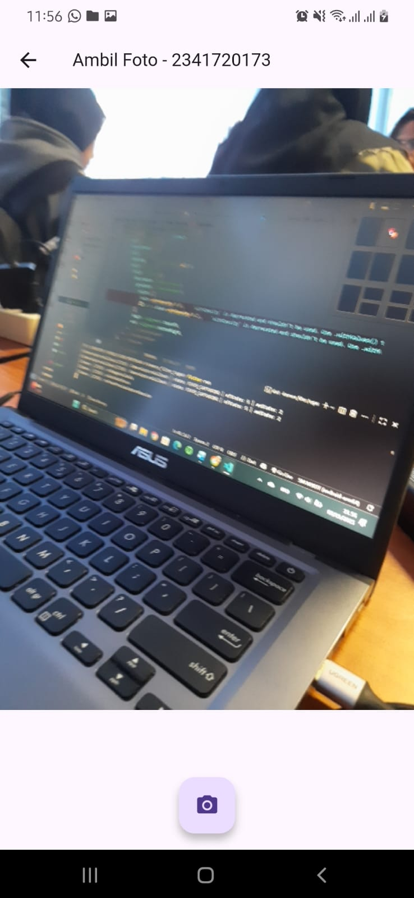
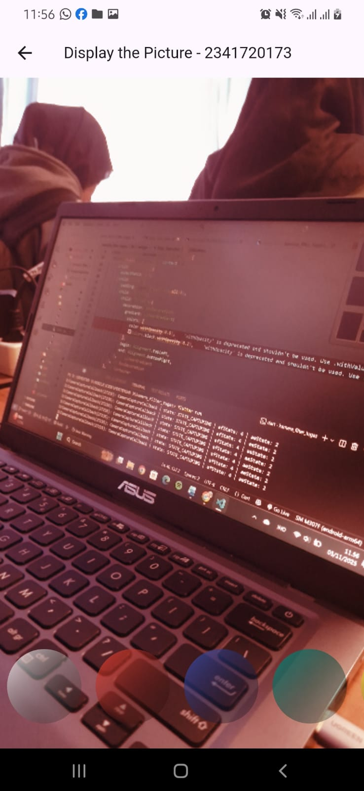

# Praktikum Flutter - Kamera dan Filter Carousel

## Praktikum 1: Mengambil Foto dengan Kamera di Flutter

## Praktikum 2: Membuat photo filter carousel

## Tugas Praktikum

2. Gabungkan hasil praktikum 1 dengan hasil praktikum 2 sehingga setelah melakukan pengambilan foto, dapat dibuat filter carouselnya!

3. Jelaskan maksud void async pada praktikum 1?
- Agar tidak langsung selesai, tapi menunggu dulu proses mencari kamera (atau proses lain yang lambat), agar saat aplikasi berjalan, kamera sudah siap digunakan, dan tidak error karena controller kamera belum terinisialisasi.

4. Jelaskan fungsi dari anotasi @immutable dan @override ?
- jika @immutable berfungsi sebagai penanda class tidak bisa diubah setelah dibuat. 
- jika @override berfunngsi sebagai 
penanda kita mengganti method dari class induk.
