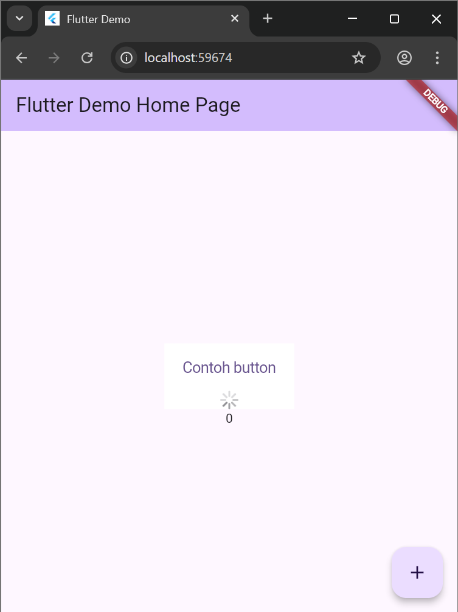
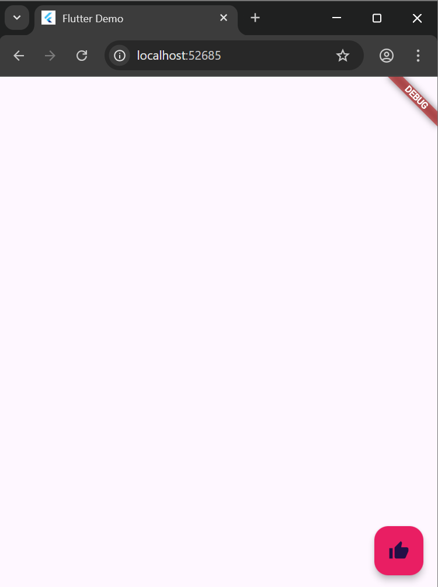
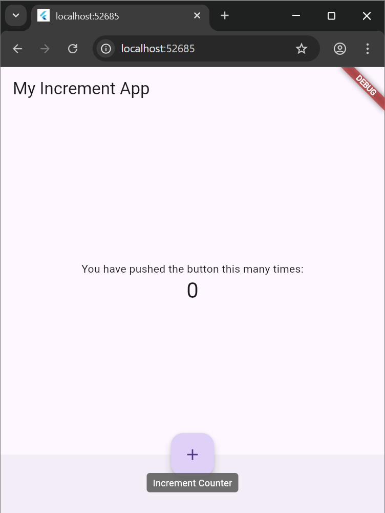
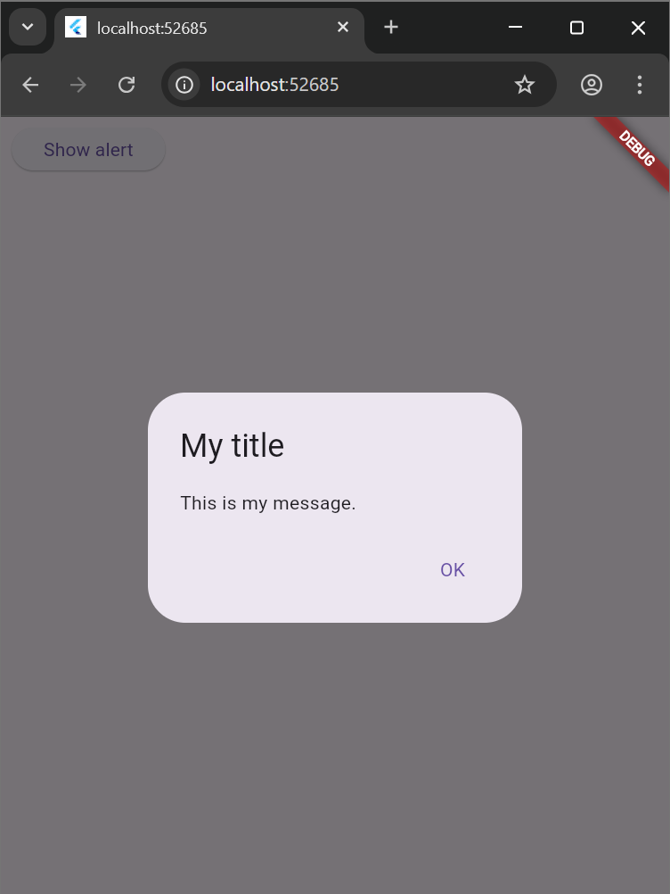
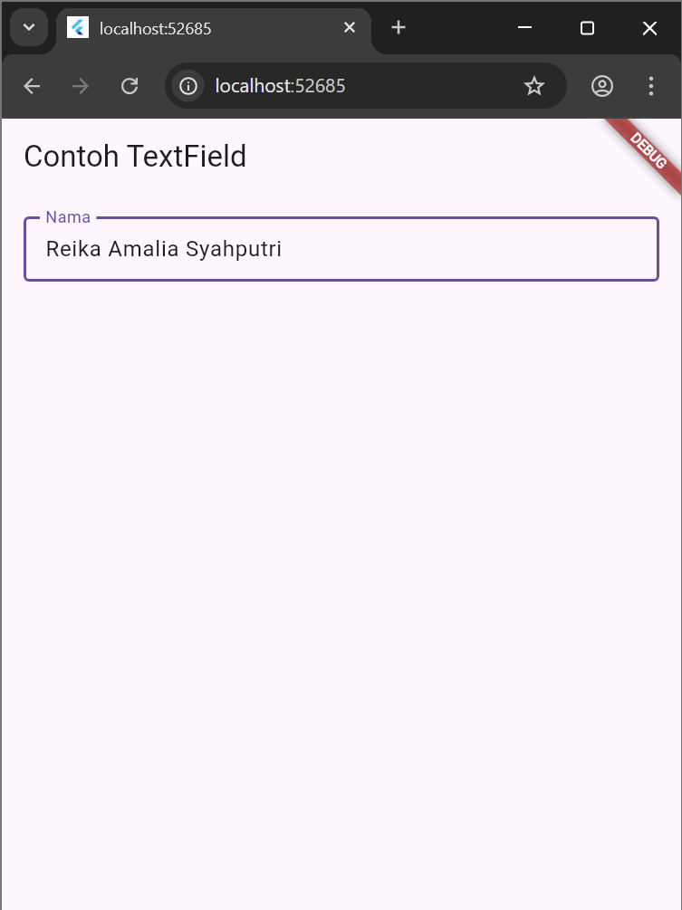
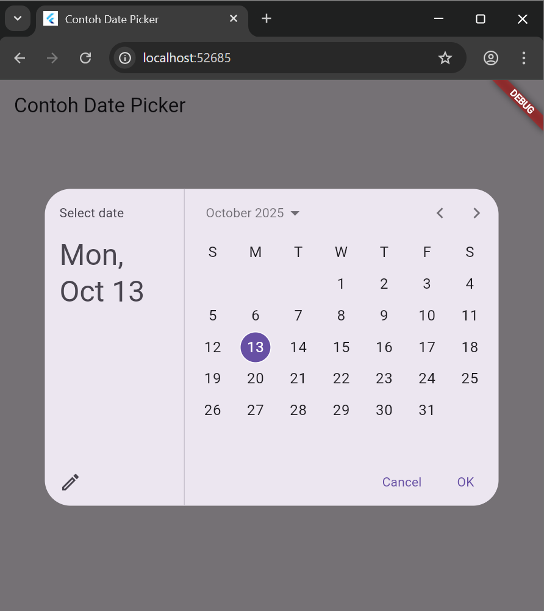

# hello_world

A new Flutter project.

## Getting Started

This project is a starting point for a Flutter application.

A few resources to get you started if this is your first Flutter project:

- [Lab: Write your first Flutter app](https://docs.flutter.dev/get-started/codelab)
- [Cookbook: Useful Flutter samples](https://docs.flutter.dev/cookbook)

For help getting started with Flutter development, view the
[online documentation](https://docs.flutter.dev/), which offers tutorials,
samples, guidance on mobile development, and a full API reference.

## Praktikum 2
### Menghubungkan ke perangkat android

## Praktikum 4
### Langkah 1: Text Widget

### Langkah 2: Image Widget

## Praktikum 5
### Menerapkan Widget Material Design dan iOS Cupertino
 Langkah 1: Cupertino Button dan Loading Bar
 

 Langkah 2: Floating Action Button (FAB)
 

 Langkah 3: Scaffold Widget
 

 Langkah 4: Dialog Widget
 

 Langkah 5: Input dan Selection Widget
 

 Langkah 6: Date and Time Pickers
 

 